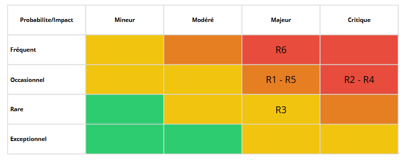

# fourty-percent-french
Depot architecture logicielle


## Documentation Architecture

- **[Architecture Edge/Local (MQTT, Preprocessing, Postprocessing)](local/ARCHITECTURE.md)** - Architecture de la partie locale/Edge du système
- [Architecture Cloud (Kafka, Validator, Alert Enrichment, Notification) ](cloud/architecture.md) - Architecture de la partie Cloud du système

---

## Comment lancer/utiliser le projet

### Prérequis

- Docker ≥ 20.x
- Docker Compose ≥ 2.x

---

### 1. Réseau Docker `shared`

Le projet utilise un réseau Docker nommé `shared` pour permettre à tous les services (Kafka, PostgreSQL, microservices, Kafka-UI, etc.) de communiquer entre eux.

Créer le réseau si nécessaire :

```docker network create shared```

---

### 2. Variables d’environnement

Définir les variables d'environnement nécessaires dans le terminal :

```
DB_USERNAME=admin
DB_PASSWORD=admin123
DB_NAME=mydb
DB_HOST=postgres
DB_PORT=5432

SMTP_USER=mail@gmail.com
SMTP_PASS=password
```

> Remplace `SMTP_USER` par l'adresse mail qui va être utilisé par le serveur SMTP pour l'envoi des mails
> Remplace `SMTP_PASS` par le mot de passe d'application lié au compte de l'adresse mail ci-dessus

---

### 3. Lancer le projet

Le projet est divisé en deux parties : `local` et `cloud`. Il faut lancer Docker Compose dans chacun des dossiers séparément.
Il faut lancer la partie cloud en premier et une fois celle-ci mise en place, il est possible de lancer la partie local.

#### 3.1 Dossier cloud

```
cd cloud
docker compose up --build
```

#### 3.2 Dossier local

```
cd local
docker compose up --build
```

## Comment contribuer à notre projet

Pour participer au projet, suivez cette démarche :

- Forkez le dépôt.

- Créez une branche dédiée pour votre fonctionnalité ou correction.

- Soumettez une Pull Request détaillant clairement :

    - Les améliorations ou corrections apportées

    - Les impacts possibles sur le reste du projet

    - Toute information utile pour la revue

**Règles à respecter si vous souhaitez que vos modifications soient intégrés**

- Ne modifiez pas l’architecture sans accord préalable.

- N’ajoutez pas de dépendances externes sans justification.

- Adoptez le style, les conventions et la nomenclature du projet.

- Commentez vos modifications si nécessaire et mettez à jour la documentation associée.

- Assurez-vous que vos changements ne cassent pas les fonctionnalités existantes et ajoutez des tests si approprié.

<br>
<br>
<br>
<br>
<br>

## Analyse des risques

### Contexte et objectif
Ce document présente l’analyse des risques liée à notre chaîne d’alerting IoT (capteurs → pré/post-traitement → Validator → Kafka → Enrichment → Notification), ainsi que les mesures de mitigation implémentées **dans l’architecture** et celles à renforcer. Il sert de référence pour l’équipe (dev, ops, sécurité) et pour le rapport de soutenance.

### Périmètre
- **Inclus** : flux d’événements, qualité des données, contrats d’échange, routage des notifications, sécurité opérationnelle (secrets, transport), observabilité.
- **Exclus** : sécurité physique des capteurs, réseau des établissements, gestion RH/discipline des destinataires finaux, aspects réglementaires non techniques (ex. archivage légal), UI/UX des clients de notification.

### Vue d’ensemble de l’architecture (rappel)
- **Capteurs & MQTT** : acquisition, QoS, pré/post-traitement (bornes de plausibilité, fenêtres, cooldown, détection *stale*).
- **Validator MS** : contrôle d’entrée (schéma strict – ex. Joi), assainissement du payload.
- **Kafka** : bus d’événements entre services (topics dédiés, partitions, consumer groups, reprise).
- **Alert Enrichment MS** : enrichissement métier (contextualisation patient → soignants) avec **Postgres**.
- **Notification MS** : envoi (ex. e-mail), TLS, variables d’environnement pour les secrets.
- **Timeseries/Influx** : stockage séries temporelles, supervision de trous/outliers et historique métier.
- **Observabilité** : endpoints /health, métriques techniques et métier (taux d’alerte, latence, erreurs).

### Méthodologie d’analyse
- **Matrice 4×4** : Probabilité (Exceptionnel, Rare, Occasionnel, Fréquent) × Impact (Mineur, Modéré, Majeur, Critique).
- **Principes** : détecter tôt, isoler au bon maillon, dégrader gracieusement, tracer et alerter, corriger sans effet domino.

### Matrice


### Registre des risques

#### R1 — Perte ou duplication d’alertes
**Description** : une alerte est perdue, traitée en double, ou retardée de façon significative.  
**Causes probables** : panne transitoire d’un service, rebalance consumer, timeouts réseau, idempotence absente.  
**Mitigation (architecture)** :
- **Kafka** entre services (topics dédiés, partitions, consumer groups) en *at-least-once* pour reprise et tampon.
- **Retries/heartbeats** côté consumers pendant les envois lents (ex. SMTP), timeouts configurés.  
**Vérification/monitoring** :
- Compteurs *produced vs. consumed* par topic/partition, lag consumer, DLQ si mise en place.  
**Améliorations recommandées** :
- Clés de message stables (ex. `deviceId+timestamp`) et **idempotence** côté consumers, **DLQ** par flux critique.

#### R2 — Faux positifs ou non-détection
**Description** : génération d’alertes inutiles (bruit) ou absence d’alerte lors d’un événement réel.  
**Causes probables** : valeurs aberrantes, jitter, capteur instable, payload incomplet ou hors schéma.  
**Mitigation (architecture)** :
- **Pré/Post-processing** : bornes de plausibilité, **fenêtres** de confirmation, **cooldown**, détection *stale*.
- **Validator** : schéma strict à l’entrée, rejet/sanitization des payloads invalides.  
**Vérification/monitoring** :
- Taux de faux positifs estimé, *precision/recall* sur datasets d’essai, latence alerte, distribution des valeurs filtrées.  
**Améliorations recommandées** :
- Jeux de tests bruités, seuils adaptatifs par capteur, métriques qualité (KPIs ML-like) exposées.

#### R3 — Acheminement aux mauvais destinataires
**Description** : la notification part au mauvais soignant ou à une cible inexistante.  
**Causes probables** : mapping patient→soignants incomplet, doublons, emails invalides.  
**Mitigation (architecture)** :
- **Alert Enrichment ↔ Postgres** : lookup destinataires avec **fallback**, déduplication ; **Notification** valide la cible avant envoi.  
**Vérification/monitoring** :
- Taux d’envois avortés pour cible invalide, logs d’enrichment, audits de mapping.  
**Améliorations recommandées** :
- Contraintes d’intégrité (FK), tests d’intégration “routing”, qualité des données sur Postgres.

#### R4 — Fuite de données / compromission des secrets
**Description** : exposition de secrets (SMTP/JWT/DB) ou d’informations sensibles.  
**Causes probables** : secret dans le code/dépôt, logs verbeux, stockage non chiffré, canaux non chiffrés.  
**Mitigation (architecture)** :
- Secrets fournis par **variables d’environnement**, transport **TLS** côté Notification, principe du **moindre privilège** par service.  
**Vérification/monitoring** :
- Scan de secrets sur dépôt, revue des logs, alerte sur échecs d’auth et anomalies d’accès.  
**Améliorations recommandées** :
- Stockage **Secrets** (Docker/K8s), rotation régulière, tokens expirables, masquage de champs sensibles dans les logs.

#### R5 — Cassure du pipeline (contrat JSON non aligné)
**Description** : un service produit/consomme un format inattendu, provoquant des erreurs en chaîne.  
**Causes probables** : évolution non coordonnée, champs manquants, types divergents, tolérance laxiste.  
**Mitigation (architecture)** :
- **Validator** : validation stricte à l’entrée ; **Enrichment** : DTO/records typés ; **Kafka** : contrat d’échange entre services.  
**Vérification/monitoring** :
- Taux de messages rejetés par schéma, erreurs de désérialisation, tests de contrat en CI.  
**Améliorations recommandées** :
- Champ `schema_version`, compatibilité ascendante, **Schema Registry** (Avro/JSON) si possible.

#### R6 — Capteur indisponible ou données aberrantes
**Description** : absence prolongée de données ou séries bruitées rendent l’alerte non fiable.  
**Causes probables** : panne capteur/alimentation, réseau local, dérives hardware.  
**Mitigation (architecture)** :
- **MQTT → Post-processing → Influx** : détection *no data*, filtrage/outliers, fermeture/ré-ouverture d’alerte propre.
- Endpoints **/health** pour supervision des microservices.  
**Vérification/monitoring** :
- Taux de *no data* par device, variance/écarts anormaux, temps moyen de rétablissement.  
**Améliorations recommandées** :
- QoS MQTT adapté, backoff/retry sur gateway, règles d’alerting Prometheus sur trous de données.

### Cartographie des contrôles par composant
- **Validator MS** : R2, R5 (barrière d’entrée – schéma strict, payload propre).
- **Kafka** : R1, R5 (tampon, reprise, séparation de responsabilités).
- **Alert Enrichment MS + Postgres** : R3, R5 (routage fiable, typage/DTO côté service).
- **Notification MS** : R1, R3, R4 (envoi robuste, vérification cible, TLS, secrets env).
- **Pré/Post-processing + Influx** : R2, R6 (qualité signal, séries temporelles, détection *stale*).
- **Observabilité (/health, métriques)** : tous risques (détection précoce, diagnostic, MTTR).

### Stratégie de tests et validation
- **Tests de contrat** : schéma d’entrée, payloads de non-régression, `schema_version`.
- **Tests d’intégration E2E** : du capteur simulé à la Notification, avec jeux de données bruités.
- **Tests de robustesse** : coupures ciblées (chaos sur consumers Kafka), latence SMTP, rebalances.
- **Tests de charge** : volumétrie par topic, latence bout-à-bout, saturation contrôlée.
- **Tests sécurité** : scans de secrets, revue TLS, rotation/permissions, logs sans PII.

### Observabilité & KPIs
- **Techniques** : lag Kafka, taux retry, erreurs par service, disponibilité /health, latence E2E.
- **Métier** : ratio alertes valides/faux positifs, temps de prise en compte, taux *no data* par device.
- **Alerting** : seuils sur lag, montée des 4xx/5xx, trous séries temporelles, débits anormaux.

### Gestion du changement (contrats & schémas)
- Introduire `schema_version` dans les messages ; préserver la compat ascendante sur N versions.
- Pipeline CI : tests de contrat obligatoires ; publication de changelog de schéma.
- Optionnel : **Schema Registry** pour gouvernance et compatibilité (BACKWARD/Full).

### Sécurité opérationnelle
- Secrets via environnement/Secret store ; rotation planifiée ; droits minimaux par service.
- TLS pour les transports externes (SMTP/HTTP) ; chiffrement au repos si requis.
- Journaux : filtrage des champs sensibles, redaction ; corrélation d’événements de sécurité.

### Risque résiduel et plan d’amélioration
- Les contrôles actuels réduisent significativement R1–R6.
- Priorités d’amélioration (backlog) : idempotence consommateurs + DLQ (R1), `schema_version` + tests de contrat (R5), métriques *precision/recall* et datasets bruités (R2), règles d’alerting “no data” (R6), durcissement gestion des secrets (R4).

### Hypothèses et dépendances
- Réseau et alimentation des capteurs hors périmètre mais *supposés* raisonnablement fiables.
- Destinataires et mapping en base maintenus par le référentiel métier.
- Les boîtes e-mail cibles peuvent accepter nos messages (relais/TLS, SPF/DMARC hors périmètre).

### Glossaire
- **Stale** : données périmées depuis un délai défini.
- **Idempotence** : traitement répété d’un même message sans effet multiple.
- **DLQ** : file d’attente des messages en échec définitif.
- **DTO** : objet de transfert de données typé entre couches/services.
