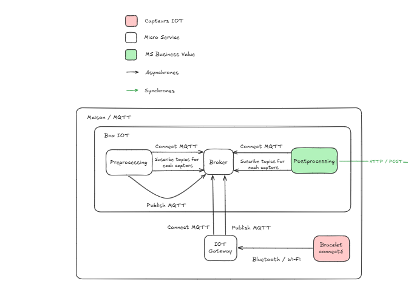

# Architecture Edge/Local - VitalWatch IoT Health Monitoring

---

## Vue d'ensemble

L'architecture locale (Edge Computing) représente la première couche de traitement du système **VitalWatch**.

Elle est déployée physiquement dans la maison et gère la collecte, la validation et l'analyse des données vitales des patients en temps réel.  
Cette couche Edge permet une détection rapide, une résilience locale en cas de coupure réseau, et une réduction des coûts de transfert.

---

## Schéma d'Architecture



*Schéma représentant l'architecture locale avec MQTT, Preprocessing, Postprocessing et Gateway.*

---

## Les Microservices

---

### 1. IoT Gateway (Capteurs simulés)

**Rôle**

Simule les capteurs IoT médicaux portés par les patients (bracelets connectés).

**Objectif**

Dans un environnement réel, ces données proviendraient de dispositifs médicaux physiques.  
Pour le POC, la simulation permet de :
- Tester l’architecture Edge/Cloud sans matériel coûteux
- Reproduire des scénarios (bradycardie, hypoxémie)
- Valider les algorithmes d’alerte
- Démontrer le flux complet : Capteurs → Edge → Cloud → Notification

**Fonctionnement**
- Génération automatique : 1 mesure/seconde
- Valeurs réalistes :
  - BPM : 60–100
  - SPO2 : 95–100 %
- Simulation d’alertes : BPM=38, SPO2=85 %
- Publication MQTT sur :
  - `sensors/vitals/bloodPressure`
  - `sensors/vitals/bloodOxygen`

**Exemple de message**
```json
{
  "kind": "BPM",
  "streamId": "sensors/vitals/bloodPressure",
  "value": 65,
  "unit": "bpm",
  "timestamp": "2025-11-04T19:07:28Z"
}
```

**Technologies**
- Node.js
- MQTT.js
- JavaScript ES6+

---

### 2. MQTT Broker (Eclipse Mosquitto)

**Rôle**

Assure la communication entre les microservices via le pattern **Publish/Subscribe**.

**Fonctionnement**
- Reçoit les données des capteurs (Gateway)
- Distribue les messages vers Preprocessing et Postprocessing
- Persiste les messages pour garantir la fiabilité
- QoS 1 : au moins une livraison garantie

**Configuration**
- Port MQTT : 1883
- Port WebSocket : 9001
- Persistance activée

**Technologies**
- Eclipse Mosquitto 2.0.22
- Protocole MQTT

---

### 3. Preprocessing (Validation des données)

**Rôle**

Assure la première couche de validation et rejette les données illogiques avant tout traitement.

**Fonctionnement**
- Écoute les topics `sensors/vitals/*`
- Valide les plages de données :
  - BPM : 25 < valeur < 220
  - SPO2 : 50 < valeur < 100
- Publie les données valides sur :
  - `preprocessed/vitals/bpm`
  - `preprocessed/vitals/spo2`
- Rejette les valeurs aberrantes (bruit, capteur défectueux)
- Déclenche une alerte interne de **maintenance** si trop de valeurs invalides consécutives

**Technologies**
- Node.js
- MQTT.js
- Express (API health-check)

---

### 4. Postprocessing (Analyse et alertes)

**Rôle**

Analyse les données validées et détecte les situations critiques.

**Fonctionnement**
- Écoute les topics `preprocessed/vitals/*`
- Regroupe les données sur une **fenêtre glissante de 6 secondes**
- Détection :
  - Bradycardie : BPM < 45
  - Tachycardie : BPM > 120
  - Hypoxémie : SPO2 < 90 %
- Génère une alerte si 66 % des échantillons sont critiques (≥ 3 valeurs)
- Envoie l’alerte au Cloud (Validator) via HTTP POST
- Résout automatiquement l’alerte quand les valeurs redeviennent normales

**Communication avec le Cloud**
- REST POST : `http://validator_ms:3000/alert`
- Authentification : JWT Bearer Token
- Payload :
```json
{
  "timestamp": "2025-11-04T19:10:00Z",
  "alert_message": "bpm_really_low",
  "metrics": {
    "bpm_min": 38,
    "bpm_max": 42,
    "window_sec": 6
  }
}
```

**Technologies**
- Node.js
- MQTT.js
- Express
- Fetch API
- Algorithme de fenêtre glissante

---

## Fonctionnalités Complètes du Système

Cette section décrit les fonctionnalités prévues dans la version complète du projet (au-delà du POC déployé).

### 1. Alertes de maintenance
- Si le service **Preprocessing** détecte plusieurs valeurs incohérentes consécutives (ex. BPM > 300 ou SPO2 = 0), il génère une alerte de maintenance.  
- Cette alerte est envoyée au **Notification Service** pour prévenir l’équipe technique (capteur à recalibrer ou à remplacer).

### 2. Gestion de l’envoi de rapports
- Le **Postprocessing** conserve un historique local des données valides.
- Toutes les **5 minutes**, un **rapport de synthèse** est envoyé au **Validator Cloud**.
- Ce rapport contient :
  - Moyennes et min/max des valeurs sur l’intervalle
  - Statut de stabilité (Stable, Variable, Critique)
  - Timestamp de début et fin de fenêtre
- Objectif : permettre un suivi médical global et une relecture a posteriori.

### 3. Authentification Edge → Cloud (JWT)
- Chaque message HTTP envoyé au Cloud (alerte, rapport) inclut un **token JWT** obtenu au démarrage du Postprocessing.
- Ce token est généré par un service d’authentification centralisé et permet :
  - La traçabilité des Edge actifs
  - Le contrôle d’accès (sécurité patient)
  - L’expiration automatique après 1h

---

## Justification de l'Architecture

### Pourquoi une architecture Edge/Local ?

1. **Latence minimale**  
   Les alertes vitales doivent être détectées en quelques secondes (10–50 ms localement contre 200–500 ms via le Cloud).

2. **Disponibilité offline**  
   En cas de coupure Internet, la détection locale continue à fonctionner et les alertes sont loguées puis envoyées dès reconnection.

3. **Réduction des coûts de bande passante**  
   Un patient génère jusqu’à 86 400 mesures par jour.  
   En Edge, seules les alertes critiques et rapports sont transmis.

4. **Confidentialité (RGPD)**  
   Les données brutes restent locales ; seules les alertes agrégées sont envoyées au Cloud.

5. **Résilience**  
   Aucun point de défaillance unique : chaque maison/EHPAD fonctionne en autonomie.

---

### Pourquoi le pattern Publish/Subscribe avec MQTT ?

- Découplage total entre producteurs et consommateurs  
- Tolérance aux pannes (messages persistés)
- Scalabilité horizontale simple
- Transmission asynchrone, faible overhead

---

### Pourquoi REST pour Edge → Cloud ?

- Simplicité de débogage et d’intégration
- Accusé de réception immédiat (HTTP 201)
- Gestion de retry avec backoff exponentiel
- Compatible avec l’authentification JWT

---

## Justification des Technologies

| Composant | Alternative | Justification | Inconvénient accepté |
|------------|-------------|----------------|-----------------------|
| Node.js | Go, Python | Écosystème IoT mature, cohérence Edge/Cloud, développement rapide | Moins performant en CPU que Go |
| MQTT | AMQP, Redis Pub/Sub | Protocole léger, persistance, tolérance aux pannes | Moins rapide que Redis |
| Mosquitto | EMQX, HiveMQ | Léger, fiable, open-source | Pas d’UI d’administration |
| Express | Fastify, Koa | Simplicité, compatibilité Cloud | Moins rapide |
| Docker | K3s, VM | Isolation simple, portable, faible overhead | Pas de gestion multi-nœuds |
| REST | gRPC | Standard universel, lisible, outils simples | Payload plus lourd |

---

## Déploiement

L’architecture Edge est packagée avec **Docker Compose**.

```yaml
networks:
  iot-net:
    driver: bridge
  shared:
    external: true
```

**Commandes**
```bash
cd local
docker compose up --build
```

Les conteneurs Mosquitto, Gateway, Preprocessing et Postprocessing sont déployés automatiquement et interconnectés sur le réseau local `iot-net`.

---

## Technologies et Versions

| Composant | Technologie | Version |
|------------|-------------|----------|
| Runtime | Node.js | 20 (Alpine) |
| MQTT Broker | Eclipse Mosquitto | 2.0.22 |
| Client MQTT | mqtt.js | Latest |
| API REST | Express | 5.x |
| Conteneurisation | Docker + Compose | 2.x |
| Langage | JavaScript | ES6+ |

---
